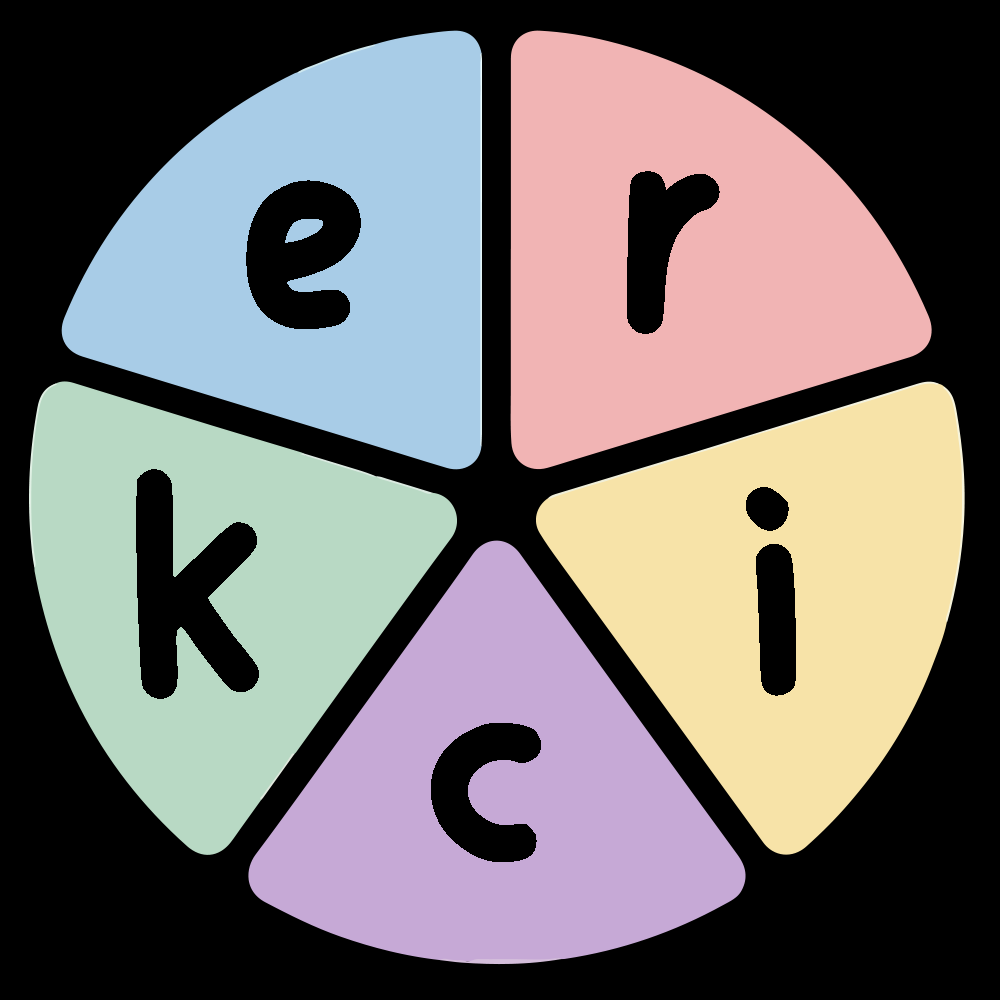
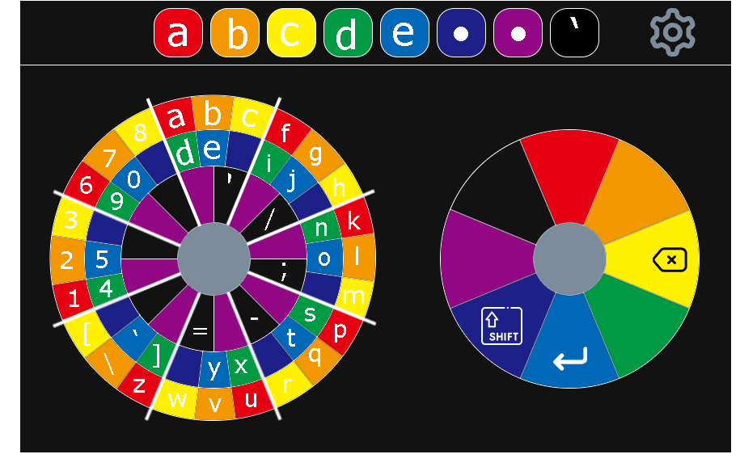

<a name="readme-top"></a>

<!-- PROJECT LOGO -->
<div align="center">
  
  <h3 align="center">Ergonomic Radial Inclusive Controller Keyboard (ERICK)</h3>
  <p align="center"><strong>Version 0.3.0-alpha</strong></p>

  <p align="center">
    An ergonomic keyboard system for Android and iOS using swipe-based chord input
    <br />
    <a href="documentation/APP_CONTEXT.md"><strong>📘 View Architecture & App Context »</strong></a>
    <br />
    <br />
    <a href="https://github.com/vatsalunadkat/Ergonomic-Radial-Inclusive-Chorded-Keyboard/issues">TODO - Visit App - Playstore Link</a>
    ·
    <a href="https://youtu.be/rrk0dRZUqbY">View Demo</a>
    ·
    <a href="https://github.com/vatsalunadkat/Ergonomic-Radial-Inclusive-Chorded-Keyboard/issues">Report Bug</a>
    ·
    <a href="https://github.com/vatsalunadkat/Ergonomic-Radial-Inclusive-Chorded-Keyboard/issues">Request Feature</a>
  </p>
</div>


<!-- TABLE OF CONTENTS -->
<details>
  <summary>Table of Contents</summary>
  <ol>
    <li>
      <a href="#about-the-project">About The Project</a>
      <ul>
        <li><a href="#built-with">Built With</a></li>
        <li><a href="#project-structure">Project Structure</a></li>
        <li><a href="#features">Features</a></li>
        <li><a href="#future-scope">Future Scope</a></li>
      </ul>
    </li>
    <li>
      <a href="#project-artifacts">Project Artifacts</a>
      <ul>
        <li><a href="#swipe-typing">Swipe Typing</a></li>
        <li><a href="#typing-with-controller">Typing with Controller</a></li>
        <li><a href="#keyboard-typing-with-no-fingers-vs-typing-with-controller">Keyboard Typing with No Fingers vs Typing with Controller</a></li>
        <li><a href="#todo-architecture-diagram">TODO Architecture Diagram</a></li>
        <li><a href="#controller-input-data-calculations-todo">Controller INPUT Data Calculations TODO</a></li>
      </ul>
    </li>
    <li>
      <a href="documentation/APP_CONTEXT.md">📘 Architecture & App Context (Detailed)</a>
    </li>
  </ol>
</details>


<!-- ABOUT THE PROJECT -->
## About The Project
<div align="center">
  
</div>

A type of ergonomic keyboard that will take input from either 2 virtual joysticks on their device screen or 2 physical joysticks of a pre-existing controller/gamepad.

The input is provided as a combination of gestures, i.e. swiping/flicking up on both joysticks will type the letter "A" (also known as a chord input). It requires the same amount of effort to type any letter, number or symbol. Removing the dependency of multiple small keys will make it accessible for people with physical disabilities. Also, the letters and numbers are positioned in a logical order making it easier for people with mental disabilities (especially autism) to use. We focused on the design characteristics and the chord coding to improve typing efficiency.

The first version released supports a simple notepad application taking in input. Further updates will support other apps (Such as WhatsApp and EverNote) and controlling the general OS GUI with the controller (Specific type of controller).

Will have different modes. The simple mode will only take input from the 2 analogue sticks. Furthur modes will take in input using multiple combinations such as the left and right trigger.

The simple mode will target disabled users who have difficulty with moving their fingers. The simple mode would only require 2 joysticks to operate and would not use other buttons and triggers.

The complex mode will target the users who want to type faster without the use of the on-screen keyboard. The complex mode would have the use of the basic 2 analog sticks plus the triggers at the back of the controller and other buttons.

Some examples of real-life use cases:
- Better typing for people with disability.
- Typing on gaming consoles and TV screens.
- Taking notes in class without looking.

Input is provided through combinations of swipe inputs or joystick movements (chord input). For example, moving the left stick right then the right stick up types "5". This approach:
- Requires equal effort for any character
- Removes dependency on fine motor skills for small keys
- Uses logical positioning for easier memorization

### Built With

* [](#) - Input Method Editor (IME)
* [](#) - Custom Keyboard Extension
* [](#) - Primary language for Android & shared logic
* [](#) - iOS native development
* [](#) - Shared keyboard logic across platforms
* [](#) - Modern Android UI
* [](#) - Modern iOS UI
* [](#) - Android preferences management
* Deployed on [](#) (Coming Soon) and [](#) (Coming Soon)

<p align="right">(<a href="#readme-top">back to top</a>)</p>

<!-- PROJECT STRUCTURE -->
### Project Structure

This is a multi-platform project supporting both Android and iOS with shared business logic:

```
ERICK/
├── android/                  # Android implementation
│   ├── app/                  # Android app module (IME service, UI, activities)
│   ├── shared/               # Kotlin Multiplatform shared module
│   │   ├── commonMain/       # Shared keyboard logic (KeyboardStateMachine, chord logic)
│   │   ├── androidMain/      # Android-specific implementations
│   │   └── iosMain/          # iOS-specific implementations
│   ├── gradle/               # Gradle configuration
│   └── README.md             # Android setup instructions
├── ios/                      # iOS implementation
│   ├── ERICK/                # iOS main app target
│   │   ├── ERICK/            # SwiftUI app (ContentView, Settings, Assets)
│   │   ├── ErickKeyBoard/    # Custom keyboard extension
│   │   │   ├── KeyboardViewController.swift
│   │   │   ├── JoystickView.swift
│   │   │   └── SettingsView.swift
│   │   └── SharedKeyboard.xcframework/  # KMP compiled framework
│   └── README.md             # iOS setup instructions
├── documentation/            # Project documentation and research
│   ├── APP_CONTEXT.md        # Architecture documentation
│   ├── demo files/           # Demo GIFs and videos
│   ├── Jira/                 # Sprint planning and tickets
│   ├── Research/             # Research papers and layout optimization
│   └── logo/                 # Branding assets
├── README.md                 # This file
├── CHANGELOG.md              # Version history
└── LICENSE                   # Project license
```

**Architecture Highlights:**
- **Shared Module (KMP)**: Core keyboard logic (state machine, chord processing, contracts) shared between Android & iOS
- **Android IME**: Custom Input Method Editor service with Jetpack Compose UI
- **iOS Keyboard Extension**: Custom keyboard with SwiftUI joystick views
- **Settings & Preferences**: DataStore (Android) / App Group UserDefaults (iOS) for persistent configuration
- **Modern UI**: JoystickView for touch input, guided onboarding, settings screen on both platforms

**Getting Started:**
- For Android development, see [android/README.md](android/README.md)
- For iOS development, see [ios/README.md](ios/README.md)
- For detailed architecture and component documentation, see [documentation/APP_CONTEXT.md](documentation/APP_CONTEXT.md)

<p align="right">(<a href="#readme-top">back to top</a>)</p>

<!-- USAGE EXAMPLES -->

### Features

**Current Implementation (v0.3.0-alpha):**

**Android:**
- [x] Input Method Editor (IME) service
- [x] Touch-based joystick input with visual feedback
- [x] Chorded keyboard logic with state machine architecture
- [x] Guided onboarding UI (enable/select IME)
- [x] Settings screen with:
  - Layout selection (Logical A–Z, Efficiency)
  - Dark theme toggle
  - Colorblind mode
  - Left-handed mode (swaps dial roles)
- [x] DataStore-based preferences persistence
- [x] Kotlin Multiplatform shared module for cross-platform logic

**iOS:**
- [x] Custom Keyboard Extension (fully functional)
- [x] SwiftUI-based joystick views with spring animations
- [x] SharedKeyboard.xcframework integration (KMP)
- [x] Settings screen with layout, theme, and accessibility options
- [x] App Group for shared preferences between app and extension
- [x] Globe button for keyboard switching (Apple requirement)
- [x] Onboarding flow with keyboard enable instructions

**Shared Features (via Kotlin Multiplatform):**
- [x] Cross-platform KeyboardStateMachine
- [x] Logical layout (A–Z alphabetically organized)
- [x] Efficiency layout (optimized for English letter frequency)
- [x] Left-handed mode support (swaps left/right dial roles)
- [x] Single-swipe utility gestures (Space, Enter, Backspace, Shift, Caps Lock)

### Future Scope

**Planned Features:**
- [ ] Physical controller support (gamepad/joystick hardware)
- [ ] Complex mode with trigger/button combinations for faster typing
- [ ] Word prediction and autocorrect
- [ ] Custom chord mapping for power users
- [ ] Typing speed analytics and improvement tracking
- [ ] Tutorial game mode for learning chord combinations
- [ ] Multi-language support
- [ ] Cloud sync for settings across devices
- [ ] Play Store and App Store releases

See the [open issues](https://github.com/vatsalunadkat/Ergonomic-Radial-Inclusive-Chorded-Keyboard/issues) for a full list of proposed features (and known issues).

<p align="right">(<a href="#readme-top">back to top</a>)</p>


<!-- OTHER ARTIFACTS -->
## Project Artifacts

### Android Typing Demo (v0.2.1-alpha)


### User Onboarding Flow


### Swipe Typing


### Typing with Controller


### Keyboard Typing with No Fingers vs Typing with Controller
 vs 

### Keyboard Layout Design


<!-- CONTACT -->
<!-- ## Contact

Vatsal Paresh Unadkat
Project Link: [https://github.com/vatsalunadkat/Ergonomic-Radial-Inclusive-Chorded-Keyboard](https://github.com/vatsalunadkat/Ergonomic-Radial-Inclusive-Chorded-Keyboard)

-->

<p align="right">(<a href="#readme-top">back to top</a>)</p>


<!-- MARKDOWN LINKS -->
[React.js]: https://img.shields.io/badge/React-20232A?style=for-the-badge&logo=react&logoColor=61DAFB
[React-url]: https://reactjs.org/
